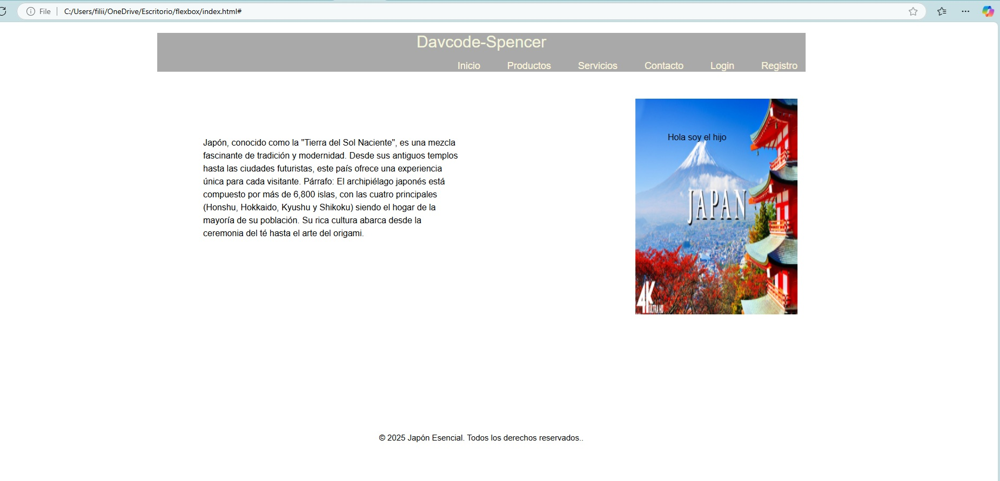

# Proyecto: Aprendiendo Flexbox

Este proyecto tiene como objetivo aprender a usar **Flexbox** en CSS para crear un diseño web responsivo y organizado utilizando HTML y CSS.

## Vista Previa


## Características
- Diseño responsivo con Flexbox.
- Estructuración básica con HTML y CSS.
- Uso de **Git** para controlar versiones y conectar con un repositorio remoto en **GitHub**.

## Instalación
1. Clona este repositorio:
   ```bash
   git clone https://github.com/spenceralejandro10/practicando-flexbox.git